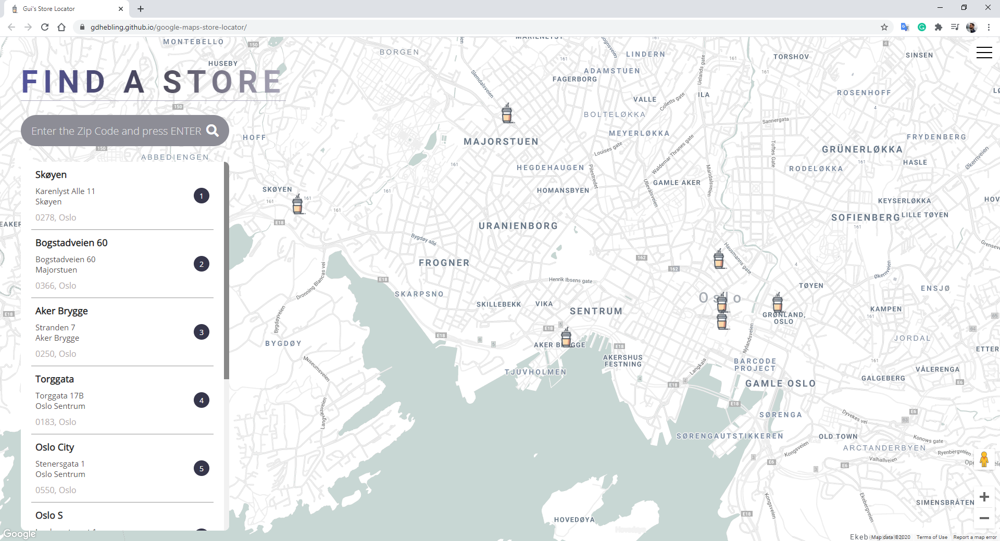

# Google Maps Store Locator

## The project
A website with search functionality integrated with the **Google Maps API**.  
Search input looks for JSON list of stores and returns the filtered results on the map.
  

### Deployed website
You can find the deployed website at https://gdhebling.github.io/google-maps-store-locator/
Please note that the Google Maps API is disabled at the moment.

## The steps
### Coding
Main functionalities of the project was integrating the Google Maps API to the website, how to get my own API key with Google Cloud Platform, my first contact with DOM Manipulation, and how to handle data from a JSON file. 
  

## Technologies and tools used
HTML5, CSS3, JavaScript, Google Maps API, and Google Cloud Platform.  

    &nbsp;&nbsp;
    &nbsp;&nbsp;
    &nbsp;&nbsp;
    &nbsp;&nbsp;
<!--     &nbsp;&nbsp; -->
    &nbsp;&nbsp;
    &nbsp;&nbsp;
    

## Contact

Gui Hebling -  
https://gdhebling.com
